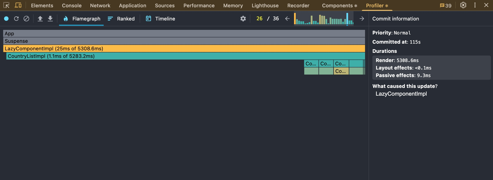
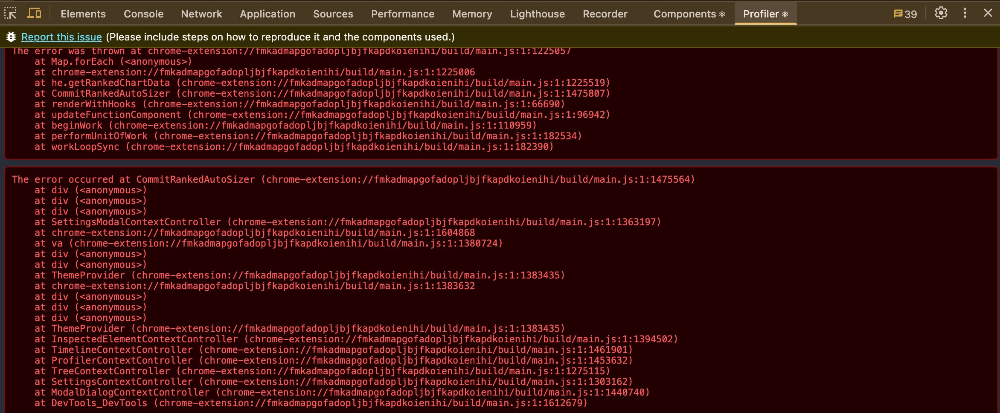
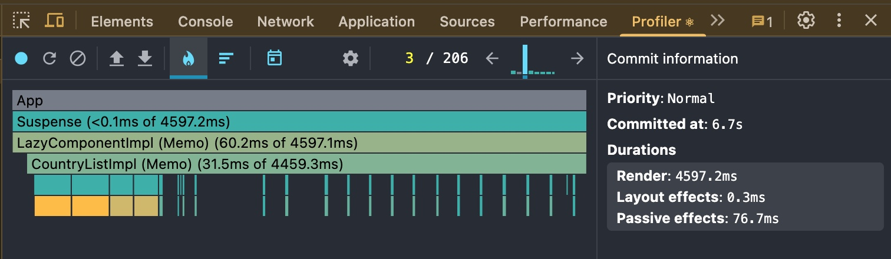
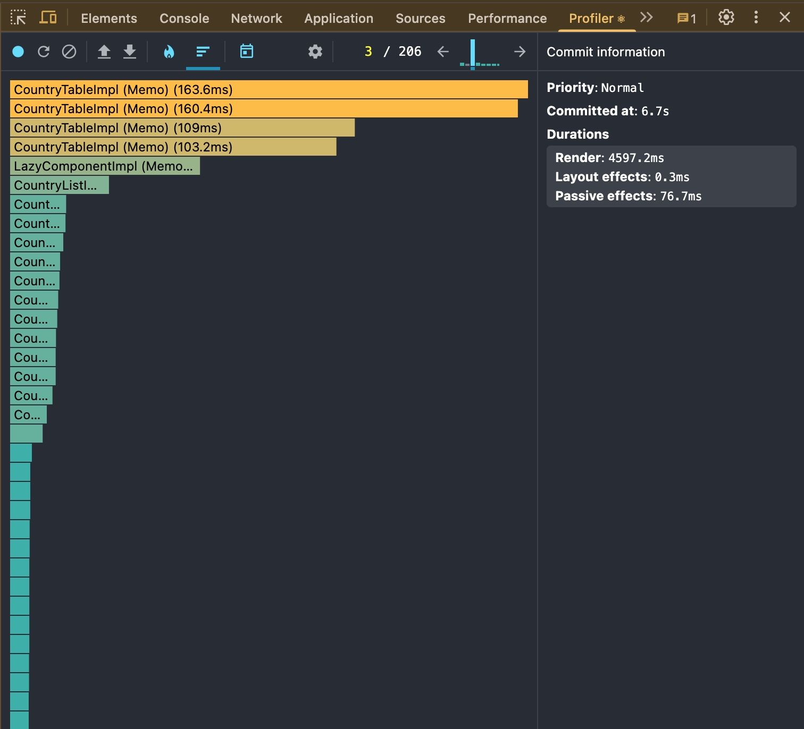

# Performance Profiling

## Initial Profiling (before optimizations)

**Tools:** React DevTools → Profiler

**Screenshots:**

- 
- 

---

## Optimizations

**Techniques used:**

- `React.memo`
- `useMemo`
- `useCallback`

---

## Profiling After Optimizations (after optimizations)

**Screenshots:**

- 
- 
